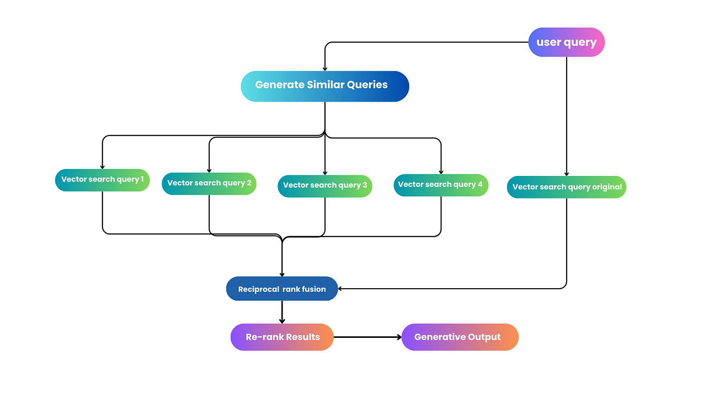

# EMBEDCHAIN POWERED CHATBOT
This is a chatbot powered by embedchain.
It uses MistralAI as it's LLM, which is provided by huggingface.
It uses ChromaDB as it's vector database, which is the default vectordb in embedchain.
It contains a small UI developed with Gradio.

## RAG-Fusion
This project uses RAG-Fusion, a search methodology that aims to bridge the gap between traditional search paradigms and the multifaceted dimensions of human queries.
The system starts by generating multiple queries from a user's initial query using the model initialized before.

