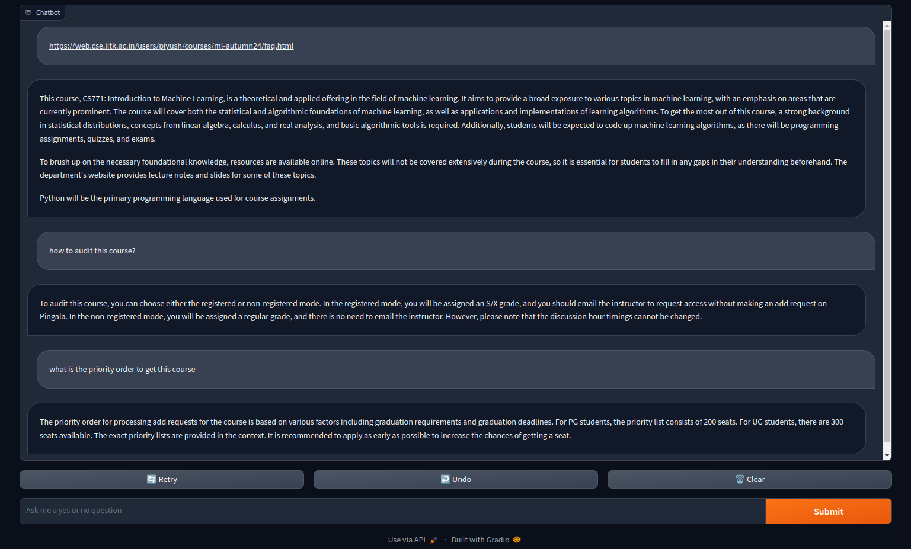

# EMBEDCHAIN POWERED CHATBOT
This is a chatbot powered by embedchain.
It uses MistralAI as it's LLM, which is provided by huggingface.
It uses ChromaDB as it's vector database, which is the default vectordb in embedchain.
It contains a small UI developed with Gradio.

## RAG-Fusion
This project uses RAG-Fusion, a search methodology that aims to bridge the gap between traditional search paradigms and the multifaceted dimensions of human queries.
The system starts by generating multiple queries from a user's initial query using the model initialized before.


The link to the paper can be found [here](https://arxiv.org/pdf/2402.03367.pdf).

## How to run
To run the chatbot, you can simply follow the below steps:
1. Clone the repository
2. Install the requirements
```bash
pip install -r requirements.txt
```
3. Run the chatbot
```bash
python3 app.py
```
4. Open the browser and go to `http://127.0.0.1:7861`



## Future Scope
The following things can be done to improve the chatbot:
1. Reciprocal Rank Fusion to re-rank search results can be introduced, to improve the search results. `https://arxiv.org/pdf/2201.01614.pdf` this paper can be referred to.
2. Functionalty to add other data types can be introduced.

## References
1. [Embedchain](https://embedchain.ai/)
2. [LangChain](https://langchain.ai/)
3. [Gradio](https://gradio.app/)
4. [Huggingface](https://huggingface.co/)
5. [PARM](https://arxiv.org/pdf/2201.01614.pdf)
6. [RAG-Fusion](https://arxiv.org/pdf/2402.03367.pdf)

